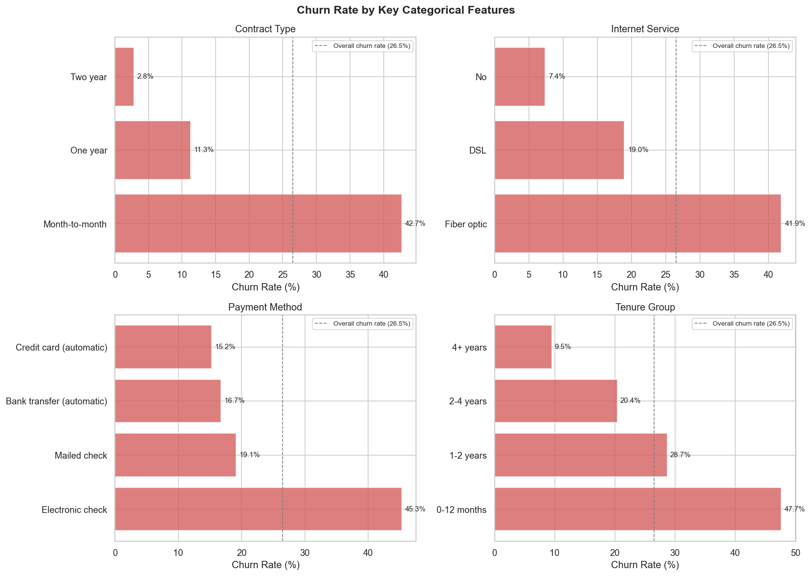
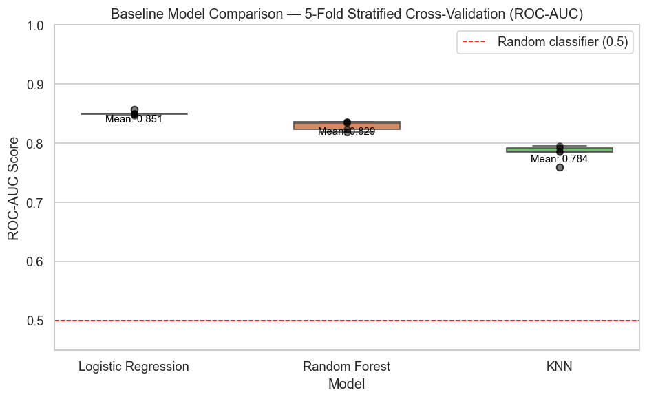
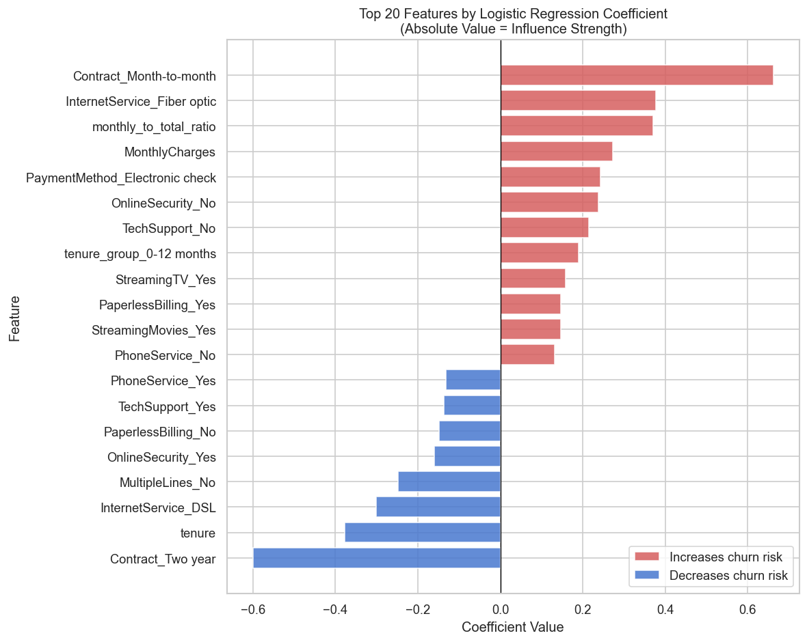
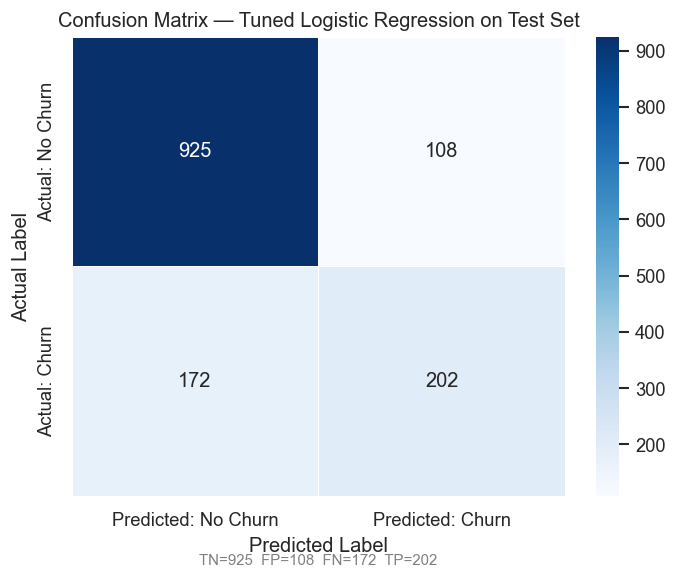

# Customer Churn Prediction

**Tools:** Python 3.13 · pandas · matplotlib · seaborn · scikit-learn 1.8.0  
**Dataset:** Telco Customer Churn (IBM / Kaggle) · 7,032 customers · 20 features  
**Notebook:** [customer_churn_prediction.ipynb](customer_churn_prediction.ipynb)

---

## Project Overview

This project builds an end-to-end supervised machine learning pipeline to predict 
which telecom customers are likely to churn. Customer churn is one of the most 
expensive problems in subscription-based industries — acquiring a new customer 
costs significantly more than retaining an existing one. Identifying at-risk 
customers before they leave gives the business a window to intervene with targeted 
retention offers.

The dataset contains information on 7,032 telecom customers including demographics, 
account details, subscribed services, billing information, and whether they churned. 
The workflow progresses from exploratory analysis through feature engineering, 
pipeline construction, model comparison, hyperparameter tuning, and final evaluation 
— producing both a deployable model and concrete business recommendations.

---

## Key Findings

| # | Finding |
|---|---------|
| 1 | **Month-to-month customers churn at 42.7%** — more than 15x the rate of two-year contract holders (2.8%) |
| 2 | **Fibre optic customers churn at 41.9%** despite paying the highest monthly charges — a price-to-value perception problem |
| 3 | **47.7% of new customers churn in their first year** — the 0-12 month cohort is the critical intervention window |
| 4 | **Electronic check users churn at 45.3%** — the highest of any payment method, nearly double the overall rate |
| 5 | **Tuned Logistic Regression achieves ROC-AUC 0.841** on the held-out test set |
| 6 | **Lowering the decision threshold to 0.3 catches 84 additional churners** — recall improves from 54.0% to 76.5% |

---

## Charts

### Churn Rate by Key Categorical Features


### Baseline Model Comparison — Cross-Validation ROC-AUC


### Feature Importance — Logistic Regression Coefficients


### Confusion Matrix — Test Set


---

## Workflow

| Step | Description |
|------|-------------|
| 0 | Setup and data loading |
| 1 | Exploratory Data Analysis — target distribution, numerical features, categorical churn rates |
| 2 | Data Cleaning — TotalCharges conversion, drop customerID, standardise SeniorCitizen |
| 3 | Feature Engineering — tenure_group, monthly_to_total_ratio, num_services |
| 4 | Preprocessing Pipeline — ColumnTransformer with StandardScaler and OneHotEncoder |
| 5 | Baseline Model Comparison — Logistic Regression, Random Forest, KNN via StratifiedKFold |
| 6 | Hyperparameter Tuning — GridSearchCV on Logistic Regression and Random Forest |
| 7 | Final Model Evaluation — ROC-AUC, accuracy, precision, recall, confusion matrix |
| 8 | Feature Importance and Threshold Analysis — coefficients and precision-recall tradeoff |
| 9 | Business Recommendations — four prioritised actions for a retention team |

---

## Model Performance

| Metric | Cross-Validation | Test Set |
|--------|-----------------|----------|
| ROC-AUC | 0.8508 | 0.8414 |
| Accuracy | — | 80.1% |
| Precision (threshold 0.5) | — | 65.2% |
| Recall (threshold 0.5) | — | 54.0% |
| Recall (threshold 0.3) | — | 76.5% |

**Model selected:** Tuned Logistic Regression  
**Best parameters:** C = 0.046, solver = newton-cg  
**Recommended deployment threshold:** 0.3

---

## Feature Engineering

Three features were engineered from the raw columns, each motivated by EDA findings:

| Feature | Description | Rationale |
|---------|-------------|-----------|
| `tenure_group` | Tenure binned into 0-12 months, 1-2 years, 2-4 years, 4+ years | Churn is non-linear with tenure — spikes in year one, drops sharply after year two |
| `monthly_to_total_ratio` | MonthlyCharges / TotalCharges | Captures customer lifecycle stage — high ratio = early-stage, higher risk |
| `num_services` | Count of active add-on services (0-6) | Proxy for engagement and switching cost |

`monthly_to_total_ratio` ranked third in feature importance — confirming the 
engineering added genuine predictive signal beyond the raw columns.

---

## Business Recommendations

1. **Target month-to-month customers in their first year with contract upgrade offers** — highest churn rate (42.7%), largest coefficient in the model (+0.662), most actionable lever available
2. **Investigate the fibre optic product** — 41.9% churn rate on the premium tier signals a price-to-value problem; survey recently churned fibre customers to identify the root cause
3. **Deploy the model at a decision threshold of 0.3** — catches 76.5% of churners versus 54.0% at the default threshold, with no additional modelling work required
4. **Bundle OnlineSecurity and TechSupport trials for high-risk customers** — 2,213 customers have zero add-on services; increasing service count raises switching cost and reduces churn risk

---

## Dataset

Download the Telco Customer Churn dataset from Kaggle:  
https://www.kaggle.com/datasets/blastchar/telco-customer-churn

Place the CSV inside a `Data/` folder in this directory before running the notebook.

---

## How to Run

1. Clone the repository
2. Download the dataset from Kaggle (see above) and place it in `Customer_Churn_Prediction/Data/`
3. Install dependencies:
```bash
pip install pandas numpy matplotlib seaborn scikit-learn jupyter
```
4. Open the notebook:
```bash
jupyter notebook customer_churn_prediction.ipynb
```
5. Run all cells top to bottom

---

## Project Structure
```
Customer_Churn_Prediction/
├── customer_churn_prediction.ipynb   # Main analysis notebook
├── README.md                         # This file
├── Data/                             # Not committed — download from Kaggle
│   └── WA_Fn-UseC_-Telco-Customer-Churn.csv
└── Figures/                          # Generated charts
    ├── churn_distribution.png
    ├── numerical_features_by_churn.png
    ├── correlation_matrix.png
    ├── categorical_churn_rates.png
    ├── baseline_model_comparison.png
    ├── gridsearch_results.png
    ├── confusion_matrix.png
    ├── feature_importance.png
    └── precision_recall_tradeoff.png
```

---

*This is Project 3 in my data analyst portfolio.*  
*→ See also: [Supplier Performance Analysis](../Supplier_Performance_Analysis/)*  
*→ See also: [Retail Inventory Optimisation](../Retail_Inventory_Optimization/)*