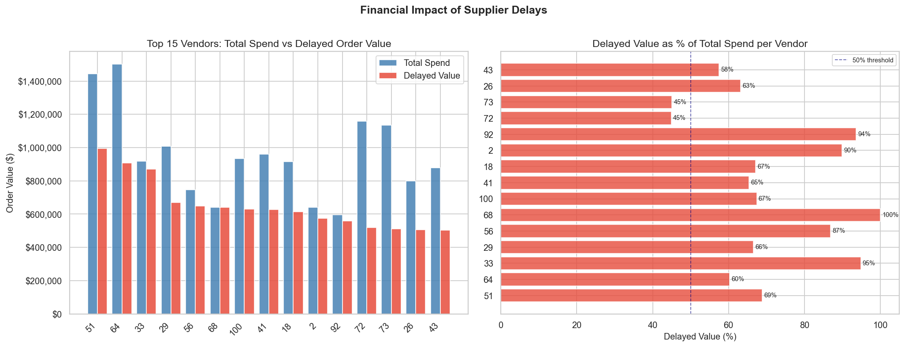
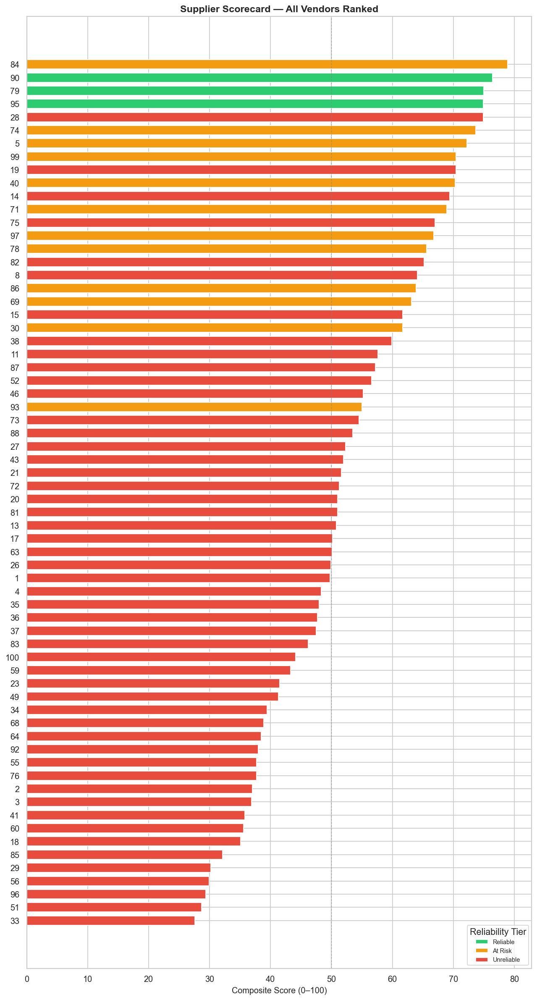
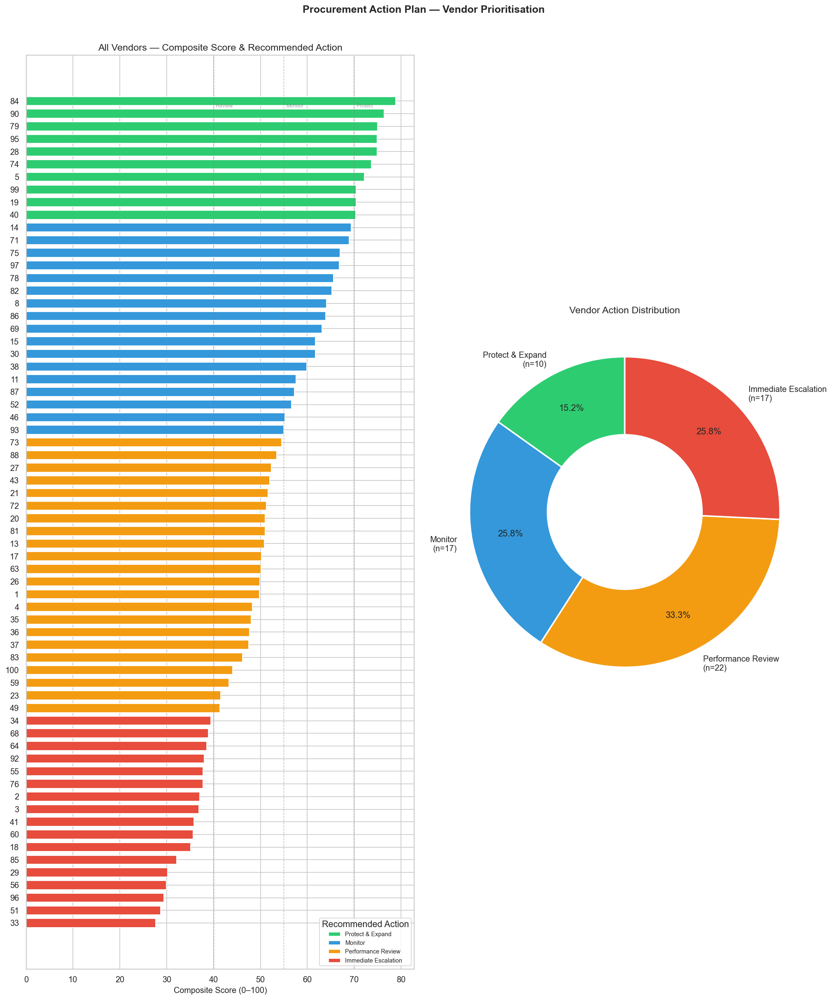

# Supplier Performance & Stockout Analysis

**Tools:** Python 3.13 · pandas · matplotlib · seaborn · scipy · sqlite3  
**Database:** Simulated SAP-style ERP (SQLite) · 11 tables · 100 vendors · 500 materials · 1,000 purchase orders  
**Notebook:** [supplier_performance_analysis.ipynb](supplier_performance_analysis.ipynb)

---

## Project Overview

This project analyses supplier delivery performance and its downstream impact  
on inventory stockouts using a simulated ERP-style SQLite database modelled  
after SAP. The database covers approximately 12 months of procurement and  
inventory activity and was generated using the  
[OCEL Inventory Management Simulator](https://github.com/LennartPurucker/ocel-inventory-management-simulator).

The analysis answers 7 business questions relevant to a procurement team,  
progressing from exploratory lead time analysis through to a composite  
supplier scorecard and actionable recommendations.

---

## Key Findings

| # | Finding |
|---|---------|
| 1 | **41.6% on-time delivery rate** — fewer than half of all deliveries met their promised deadline |
| 2 | **77.3% of vendors are Unreliable** (< 60% on-time) — poor performance is systemic, not isolated |
| 3 | **$20.99M in delayed procurement spend** — 62.8% of total analysed spend arrived late |
| 4 | **40.4% material stockout rate** — nearly 2 in 5 materials hit zero stock during the observation window |
| 5 | **Delays are vendor-behavioural** — neither order quantity (r = -0.062) nor order value (r = -0.031) correlates with delay severity |
| 6 | **51-point scorecard spread** — the best vendor scores 78.9/100, the worst 27.6/100; 17 vendors require immediate escalation |

---

## Charts

### Financial Impact of Supplier Delays


### Supplier Scorecard — All Vendors Ranked


### Procurement Action Plan


---

## Business Questions Answered

1. What are the overall supplier lead time patterns?
2. Which suppliers are most reliable (on-time delivery %)?
3. Is there a relationship between supplier delays and stockout events?
4. What is the estimated financial impact of supplier delays?
5. How does order quantity affect lead time?
6. Can we build a supplier scorecard combining multiple KPIs?
7. What actionable recommendations can be made to procurement?

---

## Database Schema

The database mimics an SAP ERP system and contains 11 tables:

| Table | Description |
|---|---|
| `PurchaseOrderDocuments` | Orders placed with suppliers — order date and vendor ID |
| `PurchaseOrderItems` | Line items within purchase orders — quantity and price |
| `GoodsReceiptsAndIssues` | All stock movements — receipt and issue dates |
| `MaterialDocuments` | Audit trail of all material movements |
| `PurchaseRequisitions` | Internal purchase requests — contains promised delivery deadlines |
| `Materials` | Master data for all 500 materials |
| `MaterialStocks` | Static snapshot of current stock levels |
| `SalesOrderDocuments` | Customer orders |
| `SalesOrderItems` | Line items within sales orders |
| `OrderSuggestions` | System-generated reorder suggestions |
| `SalesDocumentFlows` | Links between sales documents |

---

## Methodology Notes

**Lead time calculation:**  
`JULIANDAY(receipt_date) - JULIANDAY(purchase_order_date)` using  
`GoodsReceiptsAndIssues` joined to `PurchaseOrderDocuments`.

**On-time classification:**  
Delivery classified as on-time if receipt date ≤ `latest_possible_goods_receipt`  
from `PurchaseRequisitions`. Covers 54.6% of POs (546 of 1,000).

**Stockout reconstruction:**  
Running cumulative stock computed from `MaterialDocuments` using signed  
quantities (Goods Receipt = +1, Goods Issue = -1). Materials whose first  
movement was a Goods Issue were excluded to reduce opening-balance artefacts.

**Composite scorecard:**  
Four metrics, min-max normalised and weighted:  
on-time % (40%) · delayed order value (25%) · avg lead time (20%) · lead time std dev (15%)

---

## Data Quality Notes

See [data_quality.md](data_quality.md) for a full explanation of simulation  
artefacts encountered and how they were handled.

---

## Project Structure
```
Supplier_Performance_Analysis/
├── supplier_performance_analysis.ipynb   # Main analysis notebook
├── inventory_management.db               # Generated SQLite database
├── generate_database.py                  # Modified simulation script
├── README.md                             # This file
├── data_quality.md                       # Data quality notes
└── Figures/                              # Generated charts
    ├── lead_time_distribution.png
    ├── lead_time_trend.png
    ├── reliability_overview.png
    ├── vendor_ranking.png
    ├── reliability_vs_predictability.png
    ├── stockout_rate_by_tier.png
    ├── stockout_trajectories.png
    ├── financial_impact_by_vendor.png
    ├── order_value_vs_delay.png
    ├── quantity_vs_lead_time.png
    ├── quantity_lead_time_by_tier.png
    ├── supplier_scorecard_ranking.png
    ├── scorecard_metric_contributions.png
    ├── scorecard_score_distribution.png
    └── procurement_action_plan.png
```

---

## How to Run

1. Clone the repository
2. Install dependencies:
```bash
pip install pandas numpy matplotlib seaborn scipy jupyter
```
3. Open the notebook:
```bash
jupyter notebook supplier_performance_analysis.ipynb
```
4. Run all cells top to bottom — the database is included in the repository

---

*This is Project 2 in my data analyst portfolio.*  
*→ See also: [Retail Inventory Optimisation](../Retail_Inventory_Optimization/)*