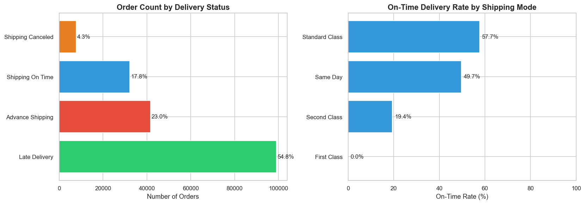
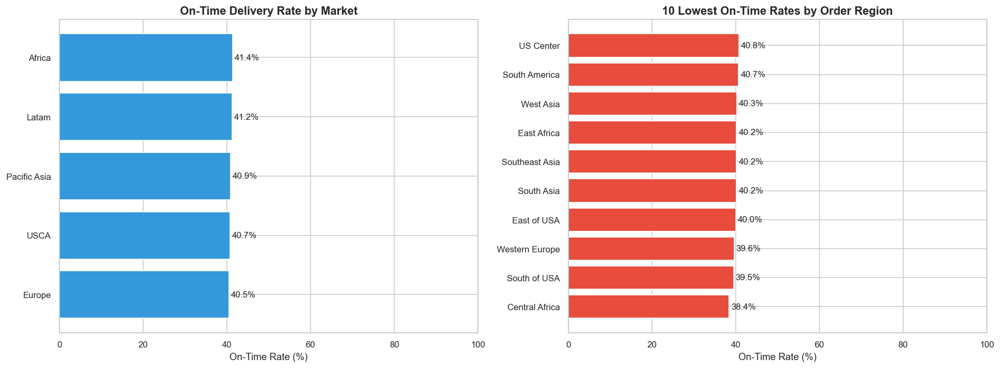
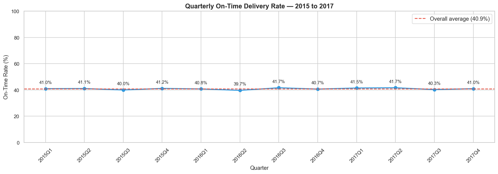
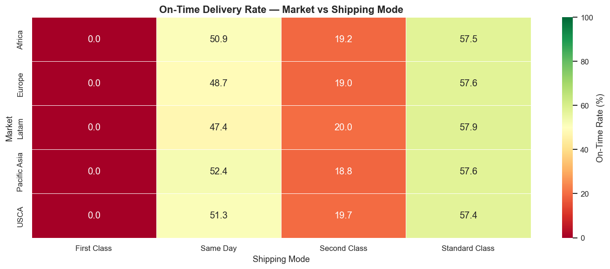
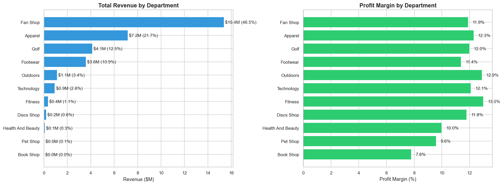
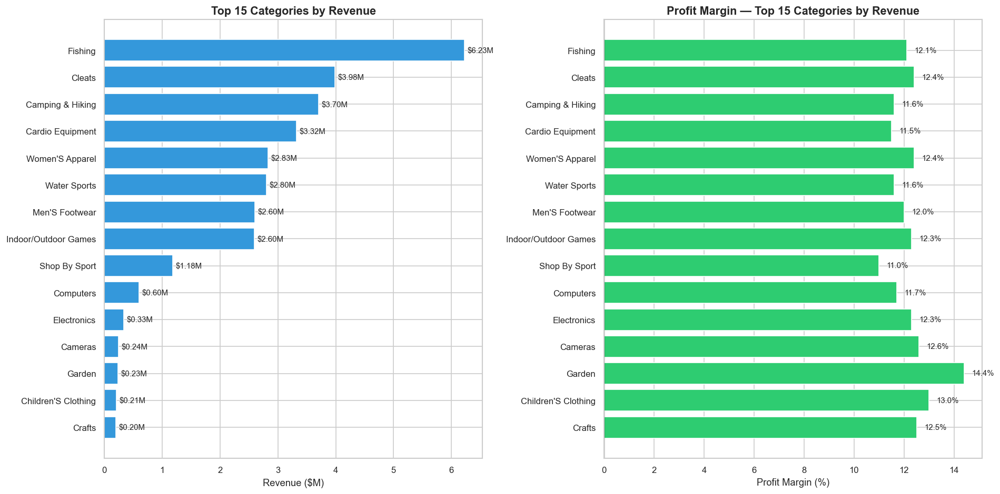
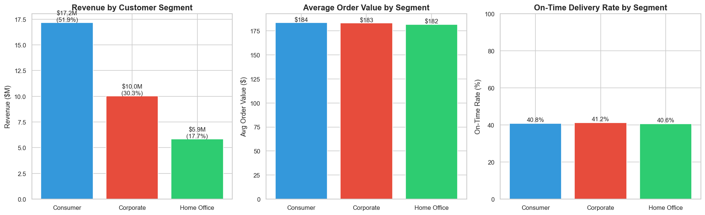
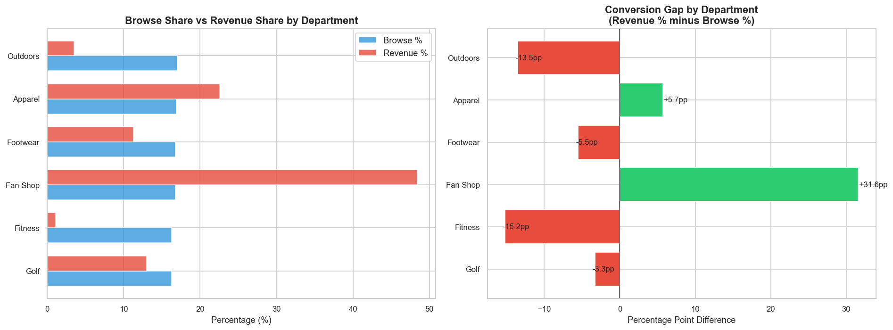

# Supply Chain Operations Dashboard

**Tools:** Python 3.13 · pandas · NumPy · matplotlib · seaborn · Power BI  
**Dataset:** DataCo Smart Supply Chain · 180,508 orders · 2015–2018  
**Notebooks:** [supply_chain_cleaning.ipynb](supply_chain_cleaning.ipynb) · [supply_chain_EDA.ipynb](supply_chain_EDA.ipynb)

---

## Project Overview

This project builds a full analytical workflow for a global e-commerce supply chain dataset — from raw data cleaning through exploratory analysis to a two-page interactive Power BI dashboard.

The dataset covers 180,508 order lines across four years, five global markets, and eleven product departments. The workflow covers Python data cleaning, datetime and regex engineering, star schema design, and dashboard development. The two dashboard pages address the two core business questions the data can answer: how is delivery performance holding up, and where is revenue coming from?

---

## Key Findings

| # | Finding |
|---|---------|
| 1 | **59.1% of all orders are delivered late** — the majority of orders fail to meet the scheduled delivery date |
| 2 | **First Class shipping has a 0% on-time rate** across all five global markets — every First Class order in the dataset is late |
| 3 | **Delivery performance has not improved in three years** — on-time rate stays within a 2-point band around 40.9% every quarter from 2015 to 2017 |
| 4 | **Fan Shop generates 46.5% of total revenue** despite receiving the same browse traffic as every other department |
| 5 | **Fitness attracts 16.3% of browse traffic but converts only 1.1% of revenue** — the largest browse-to-purchase gap in the dataset |
| 6 | **All customer segments pay the same and receive the same service** — Consumer, Corporate, and Home Office differ by less than $2 in average order value and 0.6pp in on-time rate |

---

## Dashboard Preview

### Logistics Performance


### Sales & Commercial


---

## EDA Charts

### Delivery Performance Overview


### On-Time Rate by Market and Region


### Quarterly On-Time Trend 2015–2017


### Market vs Shipping Mode Heatmap


### Revenue and Profit by Department


### Category Revenue and Margin


### Customer Segment Analysis


### Browse vs Purchase Conversion Gap


---

## Data Model

The raw flat file (52 columns, one row per order line) was split into a star schema before loading into Power BI:

| Table | Rows | Key |
|---|---|---|
| `fact_orders` | 180,508 | `Order Id` |
| `dim_customer` | 20,641 | `Order Customer Id` |
| `dim_product` | 118 | `Product Card Id` |
| `dim_shipping` | 12 | `Shipping Id` |
| `dim_date` | Built in DAX | `Date` |

---

## Python Cleaning Highlights

**Datetime engineering:**
- Parsed order and shipping date strings into datetime objects
- Calculated actual lead time in days from order to dispatch
- Engineered delivery delay, on-time flag, and lead time performance bands
- Extracted year, month, quarter, and year-month for time intelligence

**Regex cleaning:**
- Standardised city names, regions, and segment labels
- Fixed acronym casing — USCA, US Center, East of USA
- Parsed URL structure from access log file to extract department, category, and product name using path pattern matching
- Decoded percent-encoded characters (%20, %26, %27) from URL strings

**Feature engineering:**
- `profit_margin_pct` — profit as a percentage of sales per order
- `on_time_delivery` — binary flag derived from delivery status
- `order_value_band` — quartile-based tiers with documented dollar boundaries

---

## Workflow

| Step | Description |
|---|---|
| 1 | Load and inspect raw file — shape, dtypes, nulls, duplicates |
| 2 | Datetime parsing and lead time engineering |
| 3 | String and regex cleaning — main dataset and access logs |
| 4 | Feature engineering — margin, on-time flag, value bands |
| 5 | Null handling and validation |
| 6 | Star schema split — export four clean CSVs |
| 7 | EDA — logistics analysis across shipping mode, market, and time |
| 8 | EDA — commercial analysis across departments, categories, and segments |
| 9 | Power BI — data model, DAX measures, two-page dashboard |

---

## Dataset

Download the DataCo Smart Supply Chain dataset from Kaggle:  
Search **"DataCo SMART SUPPLY CHAIN FOR BIG DATA ANALYSIS"**

Place the CSV inside the `Data/` folder before running the cleaning notebook.

---

## How to Run

1. Clone the repository
2. Download the dataset from Kaggle and place it in `Supply_Chain_Operations_Dashboard/Data/`
3. Install dependencies:
```bash
pip install pandas numpy matplotlib seaborn jupyter
```
4. Run the cleaning notebook first:
```bash
jupyter notebook supply_chain_cleaning.ipynb
```
5. Then run the EDA notebook:
```bash
jupyter notebook supply_chain_EDA.ipynb
```
6. Open `supply_chain_dashboard.pbix` in Power BI Desktop — the cleaned CSVs in `Data/Cleaned/` load automatically

---

## Project Structure
```
Supply_Chain_Operations_Dashboard/
├── Data/
│   ├── Cleaned/
│   │   ├── fact_orders.csv
│   │   ├── dim_customer.csv
│   │   ├── dim_product.csv
│   │   └── dim_shipping.csv
│   └── DataCoSupplyChainDataset.csv        # Not committed — download from Kaggle
├── Figures/                                # EDA charts
├── PowerBI Screenshots/                    # Dashboard screenshots
├── supply_chain_cleaning.ipynb
├── supply_chain_EDA.ipynb
├── supply_chain_dashboard.pbix
└── README.md
```

---

*This is Project 4 in my data analyst portfolio.*  
*→ See also: [Customer Churn Prediction](../Customer_Churn_Prediction/)*  
*→ See also: [Supplier Performance Analysis](../Supplier_Performance_Analysis/)*  
*→ See also: [Retail Inventory Optimisation](../Retail_Inventory_Optimization/)*